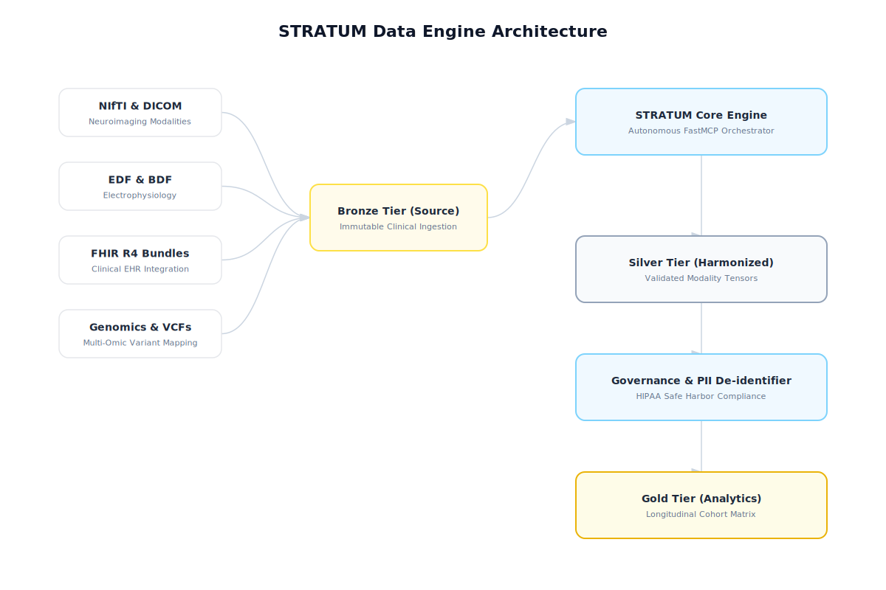

# STRATUM: Agent-driven orchestration of multimodal clinical data

The STRATUM architecture is a multi-modal clinical data processing pipeline that helps address constraints inherent in large cohort research and data collection.
## Workflow Schematic



*(Note: If the diagram above does not render in your current viewer, you can open [workflow_schematic.svg](./workflow_schematic.svg) directly in any web browser.)*

### Logical Data Flow


## Architecture Overview
...
The STRATUM architecture is built on a high-performance orchestration layer that connects clinical researchers with deep-learning-ready data objects.

### 1. AI Interaction Layer
Researchers interact with the pipeline via an **AI Orchestrator** (Claude or Gemini) using the **Model Context Protocol (MCP)**. This allows for natural language data discovery and automated tool execution.

### 2. STRATUM Core Engine
The `StratumEngine` manages the zero-trust transition of data across the Medallion tiers, coordinating with modality-specific plugins for Neuroimaging, Multi-Omics, and Wearables.

### 3. Medallion Data Tiers
*   **Bronze (Source)**: Immutable, de-identified raw clinical inputs.
*   **Silver (Harmonized)**: Domain-specific metrics mathematically validated against the `clinical_registry_master`.
*   **Gold (Analytics)**: High-dimensional, longitudinal cohorts ready for publication-grade analysis.


## Data Types and General Information
...
STRATUM is an object oriented pipeline (`StratumEngine`) with the following architecture:

*   **Bronze Tier (Raw Ingestion)**: NIfTI, DICOM, fastq-derived CSVs, REDCap exports, raw wearable JSONs
*   **Silver Tier (Harmonization)**: Zero-trust schema mapping executed via isolated plugins. Domain-specific metrics are mathematically validated against the `clinical_registry_master`, uniformity across sites.
*   **Gold Tier (Structure)**: Data is dynamically aligned along Subject (`participant_id`) and Time (`visit_session`)

---

## Supported Modalities & Pipelines

The architecture handles data processing through high-efficiency batching, allowing simultaneous evaluation of data structures.

*   **Neuroimaging (fMRI & sMRI)**: Directly ingests 4D NIfTI constructs. Utilizing `nibabel` and `nilearn`, the engine autonomously extracts BOLD (Blood-Oxygen-Level-Dependent) time-series metadata and computes functional amplitude variances natively.
*   **Multi-Omics (Genomic / Proteomic)**: Standardizes Variant Call Formats (e.g., resolving `rsid` and zygosity) and maps proteomic abundances (UniProt) securely into the cohort timeline.
*   **Clinical NLP**: Translates subjective, unstructured physician free-text into computable numerical features, extracting ontological identifiers (e.g., SNOMED-CT).
*   **Digital Biomarkers**: Deconstructs high-frequency time-series arrays representing wearable actigraphy (e.g., Continuous Heart Rate) to extract clinically significant scalar representations such as sleep efficiency.
*   **Biological Specimens & Psychometrics**: Standardizes Laboratory Information Systems (LIMS) assays and clinical survey instruments into standardized statistical bounds.

---

## Synthetic Digital Twins (The "Cold Start" Protocol)

Medical data is inherently restricted. To ensure this project is "FAIR" (Findable, Accessible, Interoperable, and Reusable) and respects the **Zero-PHI** mandate, STRATUM utilizes high-fidelity **Synthetic Data Generators**.

*   **Privacy-First Development**: Allows researchers to build and stress-test the pipeline without ever touching sensitive patient records.
*   **Zero-Friction Ingestion**: New users can instantly populate the Bronze Tier with "Digital Twins" of fMRI, Omics, and EHR data to see the Medallion flow in action.
*   **Validation Benchmarking**: Generates complex edge cases (e.g., malformed NIfTI headers or truncated genomic variants) to verify the robustness of the plugin logic.

---

## Privacy
...
Clinical environments operate under compliance constraints (HIPAA, GDPR, EU AI Act).

During the generation of the Gold Tier data object, STRATUM uses W3C-PROV Compliant Routines to append unique SHA-256 hashes to every row-wise entries. This enforces granular tracking, ensuring every tensor utilized directly connects to a raw data asset. Any variable undetected within the schema registry is automatically removed, helping prevent unapproved PHI from getting into the pipeline
---

## MCP Protocol

### Connecting to an LLM
The STRATUM Orchestrator is built using **FastMCP**. For the most reliable experience and automatic dependency management, it is recommended to run the server using **`uv`**.

1.  **Install `uv`** (if not already installed):
    ```bash
    curl -LsSf https://astral.sh/uv/install.sh | sh
    ```

2.  **Run the Server**:
    You can run the server directly or configure it in your AI client (like Claude Desktop or Cursor).
    ```bash
    uv run --with fastmcp python stratum_server.py
    ```

3.  **Configuring Claude Desktop**:
    Add the following to your `claude_desktop_config.json`:
    ```json
    {
      "mcpServers": {
        "stratum": {
          "command": "uv",
          "args": [
            "run",
            "--with",
            "fastmcp",
            "python",
            "/absolute/path/to/stratum_server.py"
          ]
        }
      }
    }
    ```

### LLM Interaction
Once attached, the LLM will automatically index STRATUM's multi-modal tools, including:
*   `process_imaging` / `process_omics` / `process_wearables`: Orchestrate ingestion for specific modalities.
*   `generate_gold_tier`: Trigger the final multi-modal longitudinal merge.
*   `check_registry_integrity`: Verify the Master Clinical Registry for schema drift.
*   `generate_synthetic_cohort`: Create high-fidelity digital twins for simulation.

---

## To run

To initialize the environment and process the sample datasets, run the setup script:

```bash
python3 scripts/setup/system_init.py
```

This will:
1. Generate synthetic multi-modal sample data in the `data/bronze` tier.
2. Register the clinical plugins and NIfTI converters.
3. Batch process the data into the `data/silver` tier.
4. Perform the final longitudinal merge into the `data/gold` tier.

